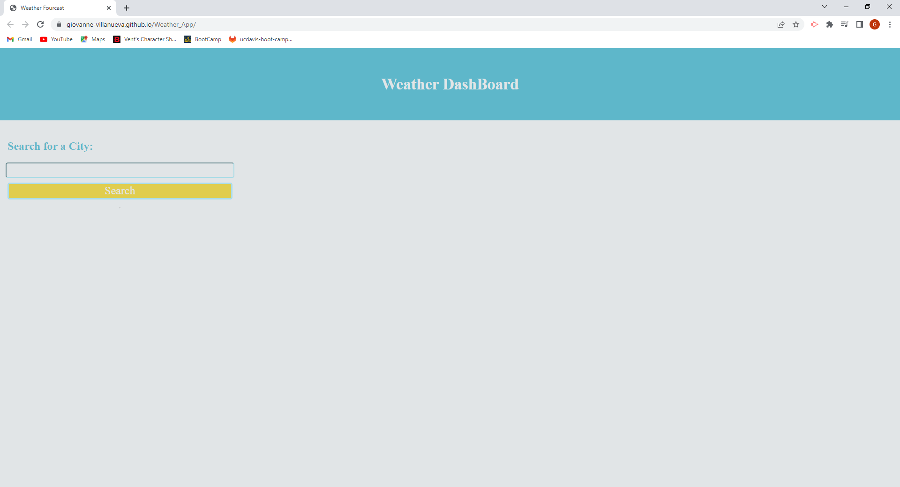
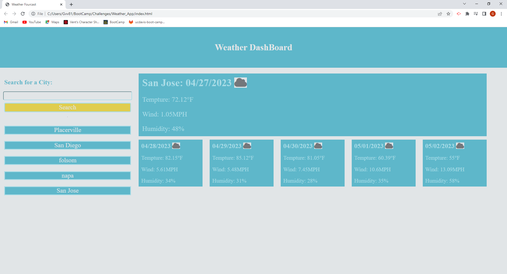
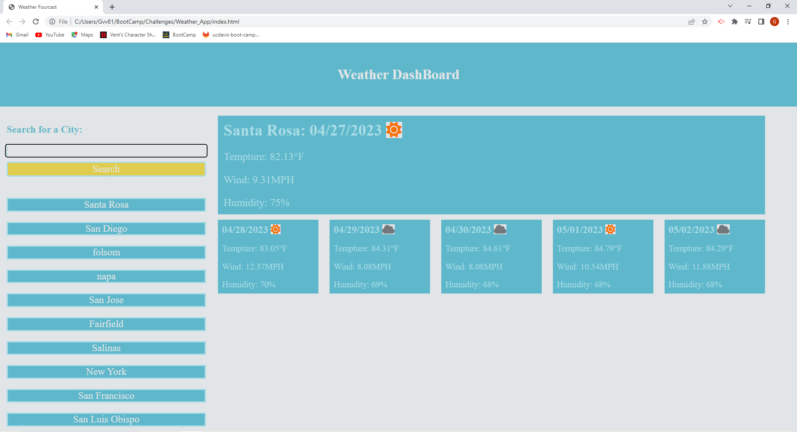

# Weather_App

## Description

I spend my days being outside for about eight hours a day and knowing the weather is essential for this. Knowing the weather helps me prepare properly for the challenges I may face outside. Given the idea of knowing the weather it seemed like a good idea to build my own weather app. The weather app project will give me a chance to learn about other third party api's. Along with giving me more expiance with a the fetch command in javascript, receving data in a json format, and see how to handel certain http error codes. 

The weather app had one weather api from OpenWeather which returned data for a givien city. I had to spend time here reading the documentation for the weather api. The api could not just be called but needs a certain key to be used. Then other parameters were needed to be put in before the weather api gave me the desired data I was looking for. Then the concept of having a ".then" in my javascript was new to me. I needed to wait for the request to be returned before I execute the rest of my code. I got to see this delay in data received in some of my weather searche results. Some search results come back almost instancely while others took a second or more. After getting all this data I used local storage in this project to help save search results. Here I learned more about local storage because if you have something in local storage and if they share the same key then all that data is saved. If I wanted to update the data in local storage I can not just call setItem. That sums up what I learned from this project. 

## Installation

I used OpenWeather api which requires an API key. The steps to aquire a key is to just make an account with OpenWeather and from there go to your account. In your account you should have an option to look for api keys. In the API key option you can generate a key which takes about an hour or more to activate before you can use it. 

Here is a link API Documentation: https://openweathermap.org/forecast5

If you click the link and click on sign. There is a button on the bottom that says create an account.

I also used font awesome to make some icons on the screen. if you follow the link below and click the start for free button it will show you how to get a kit code. the kit code is the only thing you have to replace in my html file. 

Font Awesome: https://fontawesome.com/

## Usage

The image above is the home page or inital load of the weather app. There is one input field where users can put a city name, county code, or state code. Given a valid user input we will display todays weather at the given input location. If no vaild input is entered then nothing will be displayed. If there is an issue with the OpenWeather api then an alert will be given to users by the browser.  

The image above is displaying what happens if we get a response from the weather api and where the search history is placed. Now the webpage limits the amount of past results on the page to ten results. if you exceed amount of ten then whatever the oldest search result in the search history list will be replaced. Below you can see how the search history is replaced if you compare the image below to the one above this paragraph. 

Here is a link to the webpage: https://giovanne-villanueva.github.io/Weather_App/

## Credits

Thank you OpenWeather for your api.
OpenWeather Documentation: https://openweathermap.org/forecast5

Thank you Dayjs for your Date formatting.
Dayjs Documentation: https://day.js.org/docs/en/display/format

Thank you font Awesome for your icons.
Font Awesome: https://fontawesome.com/search?c=weather&o=r

Thank you Necolas for the reset css to normalize the styling around different browsers.
GitHub Repository: https://github.com/necolas/normalize.css

## License

Please refer to repo for License